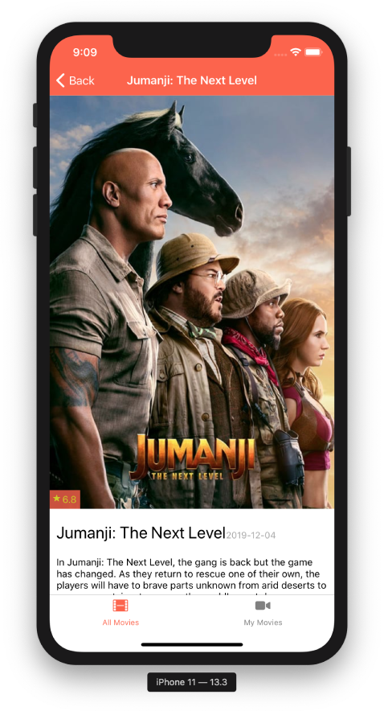

Popcorn Movies App
===
A Mobile React-Native app that reads [TheMovieDB.org](https://themoviedb.org) API and display the latest movies with
the ratings.

## Demo
 
 


## Requirments
- Java v13 (for android 🤖)
- xCode (for ios 📱)
- yarn
- react-native cli

## Installation
1. Copy the `.env.dist` file to `.env`, and set your TheMovieDB API key in it
2. Execute the following commands to run the project

    **For Android**
    ```
    yarn
    yarn run android
    ```

    **For iOS**
    ```
    yarn
    cd ios && pod install && cd ..
    yarn run ios
    ```

# Known Issues
- Zero code coverage 😞
- The keyboard covers the inputs fields while adding a new movie to the user library
- After adding a new Movie, you have to refresh "My Movies" list manually 
- No way to remove a movie from your list